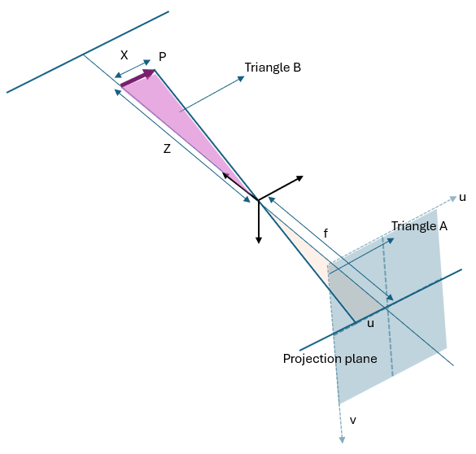
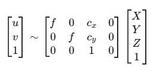

**Instrinsic Camera Calibration Notes**

Disclaimer: I have limited knowledge and trying to explain to the best of my capability, if there are any errors, or mistakes, please do let me know. Thank you!

How do we find focal length and principal point? 

We can use simple algebra to do this. 

We want to map a point P(X, Y, Z) on to the sensor p(u, v).

We see that the triangles are similar: Triangle A and Triangle B

**This is if the point is passing through the center of the refernce frame**

X/Z = u/f

u = f (X/Z) 

**Also here it is assumed that the principal point is (0, 0)**

if we take principal point based on [Intro](README.md)

then **u = f(X/Z) + cx**

similarly for **v = f(Y/Z) + cy**

When we put it in matrix we get:

We also see that we only calculated cx and cy, where are we getting X, Y, Z from. Therefore to even do the calibration (finding f, cx, and cy) we need to know the real world location of the object wrt to the camera center reference frame. 
**How do we even know where is our reference frame??**
**Ans** This is done based on relative point reference. We can do this in the code. 

