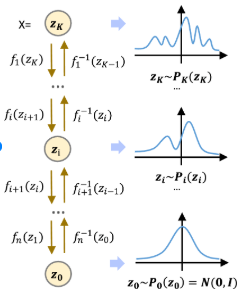

**Normalizing Flow (NF) Notes**

Disclaimer: I have limited knowledge and trying to explain to the best of my capability, if there are any errors, or mistakes, please do let me know. Thank you!

What has been experimented and learnt?

Before that just a brief of Normalizing flows. 

In simple words, Normalizing flow is modifying a dough to different shapes while keeping the area or volume equal to 1. That is maintaining the probability distribution as 1. 

Where is it useful? It is useful to generate data. How does it do it?

Let us say, we take a set of images, each image being 10pixels.10pixels. If we have a dataset of 1000 images, we have a 100 dimension data {each data point being an image (x1, x2, x3, ... , x100)} and if we plot them in a 100D space then we have 1000 data points in a 100D space. 

Now this is extremely high dimensional if we have high resolution images. And this is very helpful for Normalizing flows. Why? NF is working on dimensions, playing around the data points by scaling, shearing, twisting, or rotating. It cannot project to other dimension else invertiblilty breaks. More dimensions, it has more space to play around. 
{Changing shape of dough in 2D space vs 3D space.}

What we try to do is to change 100D space 1000 data to a simple gaussian distribution(or any other simple distribution called base distribution), also called latent space. A scattered points with no proper meaning (It inherently has, images of certain features stay close) is now moved to a simple distribution. That means, we have mapped certain images with certain features close to each other in the probability distribution (cat images closer to each other, etc within a probability space; it does not look for semantics explicity but inherently it happens to be like this for optimized output: Preserves topology, so nearby points in data space remain nearby in latent space). 

How do we generate data is answered through this. You pick any point in the simple distribution space, it can be mapped back to image/data space. And in simple distribution, the data of a certain type is close by, to generate image of cat, you pick a certain data point in latent space with probability of cat being high, you generate cat. It can generate data that we were not mapped during training(image space to latent space0. Hence, is able to generate completely new data. Pick any point z in latent space P(z) and it can give x = finv(z).

What are the conditions or where to be careful?

**Major: Invertibility.** Mapping from data is latent space with any function might not be feasible. Why? what if we are not able to find an invertible function?
{ Ex: A primary example of a non-invertible function is \(f(x)=x^{2}\) (when the domain is all real numbers. It is non-invertible because it fails the horizontal line test; different inputs produce the same output (e.g., \(f(2)=4\) and \(f(-2)=4\)), making it impossible to uniquely reverse the mapping. https://www.reddit.com/r/askscience/comments/5z8wrw/are_there_any_mathematical_operations_that_dont/#:~:text=A%20common%20example%20of%20a,test%20some%20functions%20for%20invertibility.}

**Single function:** For a data of huge dimension, finding a single function that converts to simple distribution and is invertible is near to impossible. So NF comes with the idea of using simple, small, multiple invertible functions. **(z = f1(f2(f3(...(fn(x)))))) and inverse being x = inv(fn(inv(fn-1(inv(...inv(f1(z)))))))**

 {Ref https://www.researchgate.net/figure/Normalizing-flow-aims-to-model-complex-probability-distributions-allowing-the-generation_fig4_379666646}

**Flows preserve topological connectedness of the full space.** The issue we faced in the converting a 2D gaussian unimodal to 2 modal or 2 different gaussians. It can only do the scaling, shearing, twisting, or rotating. This is where high dimensionality helps giving a bigger playground to map the data. Bimodality can appear only in projections, not as disconnected regions. Flows cannot create disconnected regions in latent space.

**ChatGpt summarized the above thing**: Normalizing Flows learn an invertible, volume-preserving transformation that maps complex high-dimensional data to a simple base distribution, enabling exact likelihoods and sampling, while preserving topology and dimensionality.

What to add to this?
The math behind NF. How do we get loss functions?
Scaling, shearing, twisting, or rotating: these are one type of transformation. **Affine coupling layers can do complex non linear transformation while preserving invertibility** (requires us to understand the equations of NF and Loss function). 
Where do we use the training part?
How do we ensure latent space is simple distribution? (the role of determinant of Jacobian)
Why use coupling?(difficult determinants)

I will add this later. I want to make it as simple as possible because when I learn't this I didn't know what Jacobian is, only to later realize it is a beautiful thing which expresses the rate of change of one coordinate frame to another. So I am going to make it very simple and easy to understand and want everyone to enjoy the core of it!

**References**

https://transform.softwareunderground.org/2022-julia-for-geoscience/normalizing-flow-training 

https://deepgenerativemodels.github.io/notes/flow/ - We have to learn change of variables formula which is the core of Normalizing flows. 

https://grishmaprs.medium.com/normalizing-flows-5b5a713e45e2  -Very nicely explained